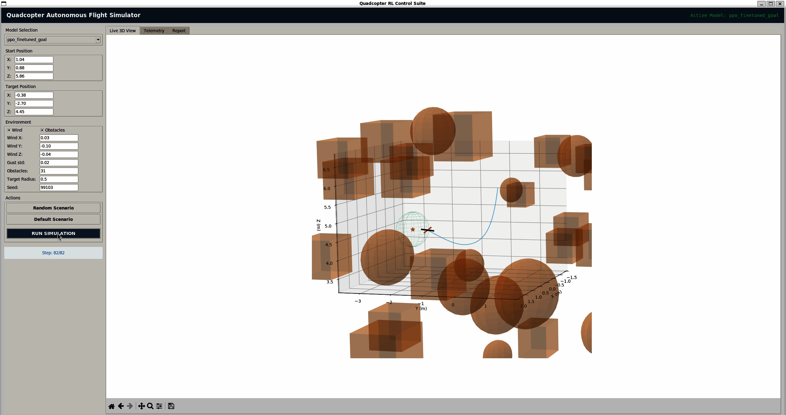

# Quadcopter Control System (C++ Simulator + Reinforcement Learning)

Проект автономного управления квадрокоптером, состоящий из физического движка на C++, Python-обёртки через pybind11, контроллера и графического интерфейса для проведения экспериментов.



## Архитектура системы

Управление системой построено по следующей схеме:

1. **Физический движок (C++):** Моделирует динамику твёрдого тела, инерцию роторов, аэродинамическое сопротивление и внешние возмущения (ветер, порывы).
2. **Биндинг (pybind11):** Передаёт состояние симулятора в Python на этапе обучения.
3. **Низкоуровневый контроллер (Python):** Регулятор, стабилизирующий заданные углы крена, тангажа, курсовой угол.
4. **Высокоуровневый агент (RL / PPO):** Модель PPO из библиотеки Stable-Baselines3. Принимает 34-мерный вектор наблюдений (16-лучевой лидар, вектор направления на цель, вектор ветра, текущее состояние) и генерирует целевые углы для контроллера.

## Структура репозитория

```
.
├── assets/
│   └── demo.gif            # Анимация работы системы
├── cpp/
│   ├── quadcopter.h        # Заголовочный файл физики
│   ├── quadcopter.cpp      # Реализация кинематики и динамики
│   └── bindings.cpp        # Связка C++ с Python через pybind11
├── python/
│   ├── env.py              # Gymnasium-среда
│   ├── controller.py       # Регулятор
│   ├── train.py            # Многопоточное поэтапное обучение
│   ├── app.py              # GUI 
│   └── animate3d.py        # 3D-визуализатор траектории
├── setup.py                # Сборка C++ расширения
└── requirements.txt        # Зависимости Python
```

## Требования и сборка

Для сборки C++ ядра требуется компилятор с поддержкой C++17 (GCC, Clang или MSVC).

1. Создание виртуального окружения и установка зависимостей:
```bash
python3.12 -m venv venv
source venv/bin/activate
pip install -r requirements.txt
```

2. Компиляция C++ модуля:
```bash
pip install --no-build-isolation .
```

## Запуск

**Графический интерфейс:**
  ```bash
  cd python
  python app.py
  ```

**Запуск обучения с нуля:**
  ```bash
  cd python
  python train.py
  ```
